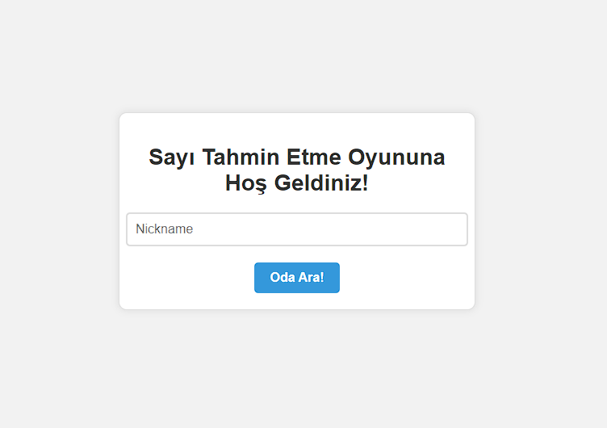
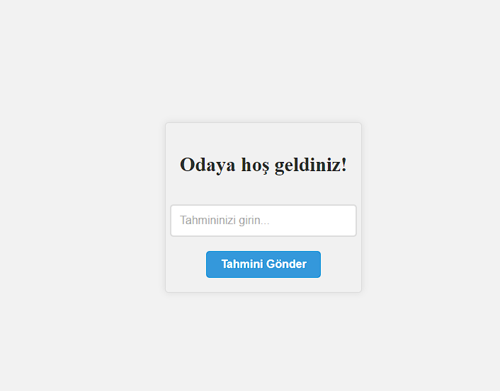
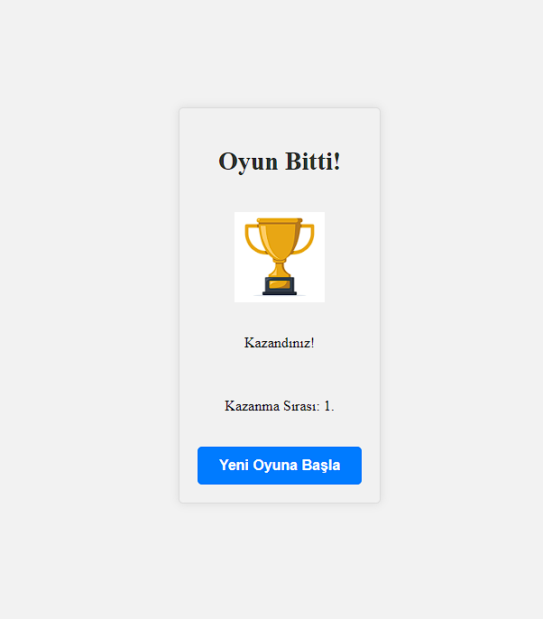

# Number Guessing Game

This project is a simple number guessing game. Players participating in the game try to guess a hidden number within a certain range. At the end of the game, the player with the closest guess wins.

## Getting Started

You can follow these steps to clone and run the project:

1. Clone the repository:

   git clone https://github.com/marikann/Number-Guessing-Game.git

2. Navigate to the project folder:

   cd project

3. Install the required dependencies:

   go mod tidy

4. Start the server:

   go run main.go

5. Open "index.html" file in your browser:

   You can play the game by opening the "index.html" file in your browser.

## How the Game Works

1. Enter a username in the "Nickname" field and click the "Join" button to join the game.

2. Enter a guess value in the "Enter your guess..." field and click the "Submit Guess" button to make a guess.

3. At the end of the game, the winning player and their rank will be displayed on the screen.

4. You can join a new game by clicking the "Start New Game" button.

## API Endpoints

## User Registration

### Endpoint: `/register`

This POST request allows users to register for the game. Send a JSON with the user's chosen nickname.

**Request:**
json
{
  "nickname": "example_player"
}
**Response:**
json
{
  "id": "user_uuid_here"
}

### Endpoint: `/stats`

This GET request returns the number of registered players and information about active rooms in a JSON format.

**Response:**
json
{
  "registeredPlayers": 100,
  "activeRooms": [
    { "id": 1, "secret": 123 },
    { "id": 2, "secret": 456 }
  ]
}

### WebSocket Command: `join`

This command allows users to join rooms. If the user is registered, they will be added to the list of waiting requests.

**Command:**
{
  "cmd": "join",
  "id": "user_uuid_here"
}

**Reply:**
{
  "cmd": "join",
  "reply": "waiting"
}

**Error:**
{
  "cmd": "join",
  "error": "notRegistered"
}

### WebSocket Command: `Joined Room`

This event indicates that the user has joined a room.

**Event:**
{
  "event": "joinedRoom",
  "room": 1
}

### WebSocket Komutu: `Guess`

**Command:**
{
  "cmd": "guess",
  "user": "user_uuid_here",
  "room": 1,
  "data": 42
}

**Reply:**
{
  "cmd": "guess",
  "reply": "guessReceived"
}

**Error:**
{
  "cmd": "guess",
  "error": "notRegistered"
}

**Error:**
{
  "cmd": "guess",
  "error": "notInRoom"
}

### WebSocket Command: `Game Over`

**Event:**
{
  "event": "gameOver",
  "secret": 123,
  "rankings": [
    { "rank": 1, "player": "user_uuid_here", "guess": 45, "deltaTrophy": 30 },
    { "rank": 2, "player": "user_uuid_here", "deltaTrophy": 20 },
    { "rank": 3, "player": "user_uuid_here", "deltaTrophy": 0 }
  ]
}

## Technologies and Tools

- Go (golang) - The language used for the server-side application.
- HTML, CSS, and JavaScript - Web technologies used for the client-side application.
- Gorilla WebSockets - Go library used for WebSocket connection.

## Screenshots

  

  

  

  

  

## Notes

- The game requires opening the "index.html" file in your browser to run. The HTML and JavaScript code is designed to work in the browser.

- Players' guesses may not accurately guess the hidden number. Therefore, the winner is determined based on the closest guesses.

- Players who accurately guess the hidden number will receive a "You Win!" message, while others will receive a "You Lose!" message.

- The server-side of the game is written in Go and communicates with the client using WebSocket.

- The main page of the project is "index.html," and you can join the game by opening it in your browser.

- You can use "Guest" or any other nickname as your username to join the game.

## Contact

Email: muhammetarikann@hotmail.com

