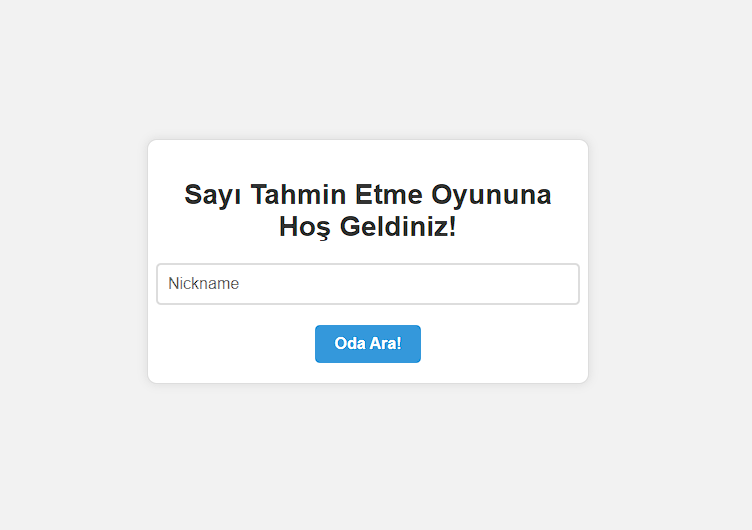
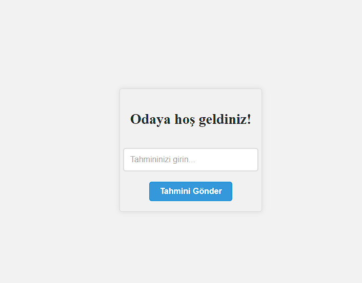
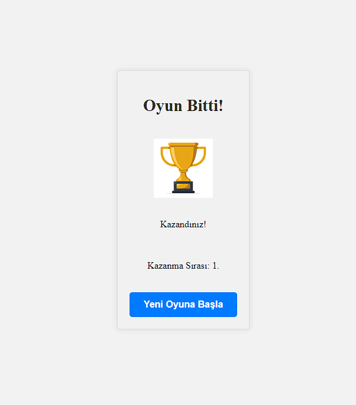
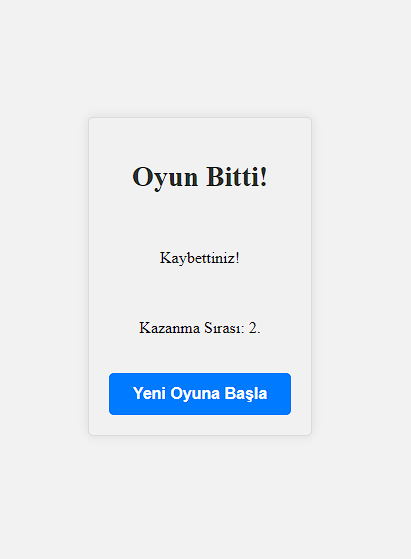

# Sayı Tahmin Etme Oyunu

Bu proje, basit bir sayı tahmin etme oyunudur. Oyuna katılan oyuncular, belirli bir aralıktaki gizli sayıyı tahmin etmeye çalışır. Oyun sonunda en yakın tahmin yapan oyuncu kazanır.

## Başlangıç

Bu adımları izleyerek projeyi klonlayabilir ve çalıştırabilirsiniz:

1. Repository'yi klonlayın:

   git clone https://github.com/marikann/Number-Guessing-Game.git

2. Proje klasörüne gidin:

   cd project

3. Gerekli bağımlılıkları yükleyin:

   go mod tidy

4. Sunucuyu başlatın:

   go run main.go

5. Tarayıcıda "index.html" dosyasını açın:

   Tarayıcınızda "index.html" dosyasını açarak oyunu oynayabilirsiniz.

## Oyun Nasıl Çalışır?

1. Oyuna katılmak için "Nickname" alanına bir kullanıcı adı girin ve "Join" düğmesine tıklayın.

2. Gizli sayıyı tahmin etmek için "Tahmininizi girin..." alanına bir tahmin değeri girin ve "Tahmini Gönder" düğmesine tıklayın.

3. Oyun sonucunda, ekranda kazanan oyuncu ve sırası gösterilecektir.

4. "Yeni Oyuna Başla" düğmesine tıklayarak yeni bir oyuna katılabilirsiniz.

## API Endpointleri

## Kullanıcı Kaydı

### Endpoint: `/register`

Bu POST isteği, kullanıcının oyuna kaydolmasını sağlar. Kullanıcı adını içeren bir JSON gönderilmelidir.

**Request:**
json
{
  "nickname": "example_player"
}
**Response:**
json
{
  "id": "user_uuid_here"
}

### Endpoint: `/stats`

Bu GET isteği, kayıtlı oyuncu sayısını ve aktif odaların bilgilerini içeren bir JSON döner.

**Response:**
json
{
  "registeredPlayers": 100,
  "activeRooms": [
    { "id": 1, "secret": 123 },
    { "id": 2, "secret": 456 }
  ]
}

### WebSocket Komutu: `join`

Bu komut, kullanıcının odalara katılmasını sağlar. Eğer kullanıcı kayıtlı ise bekleyen istekler listesine eklenir.

**Command:**
{
  "cmd": "join",
  "id": "user_uuid_here"
}

**Reply:**
{
  "cmd": "join",
  "reply": "waiting"
}

**Error:**
{
  "cmd": "join",
  "error": "notRegistered"
}

### WebSocket Komutu: `Joined Room`

Bu komut, kullanıcının odalara katılmasını sağlar. Eğer kullanıcı kayıtlı ise bekleyen istekler listesine eklenir.

**Event:**
{
  "event": "joinedRoom",
  "room": 1
}

### WebSocket Komutu: `Guess`

**Command:**
{
  "cmd": "guess",
  "user": "user_uuid_here",
  "room": 1,
  "data": 42
}

**Reply:**
{
  "cmd": "guess",
  "reply": "guessReceived"
}

**Error:**
{
  "cmd": "guess",
  "error": "notRegistered"
}

**Error:**
{
  "cmd": "guess",
  "error": "notInRoom"
}

### WebSocket Komutu: `Game Over`

**Event:**
{
  "event": "gameOver",
  "secret": 123,
  "rankings": [
    { "rank": 1, "player": "user_uuid_here", "guess": 45, "deltaTrophy": 30 },
    { "rank": 2, "player": "user_uuid_here", "deltaTrophy": 20 },
    { "rank": 3, "player": "user_uuid_here", "deltaTrophy": 0 }
  ]
}

## Katkıda Bulunma

Katkılarınızı bekliyoruz! Lütfen CONTRIBUTING.md dosyasındaki kurallara uygun olarak katkıda bulunun.

## Lisans

Bu proje MIT Lisansı ile lisanslanmıştır. Detaylar için LICENSE dosyasını inceleyebilirsiniz.

## Teknolojiler ve Araçlar

- Go (golang) - Sunucu tarafı uygulama için kullanılan dil.
- HTML, CSS, ve JavaScript - İstemci tarafı uygulama için kullanılan web teknolojileri.
- Gorilla WebSockets - WebSocket bağlantısı için kullanılan Go kütüphanesi.

## Ekran Görüntüleri

  

  

  

  

  

## Notlar

- Oyunun çalışması için "index.html" dosyasını tarayıcınızda açmanız gerekmektedir. HTML ve JavaScript kodları, tarayıcıda çalışacak şekilde tasarlanmıştır.

- Oyuncuların tahminleri gizli sayıyı doğru bir şekilde tahmin etmeyebilir. Bu nedenle, oyuncuların tahminleri baz alınarak kazanan belirlenir.

- Gizli sayıyı doğru bir şekilde tahmin eden oyuncular, "Kazandınız!" mesajı alırken, diğerleri "Kaybettiniz!" mesajı alır.

- Oyunun sunucu tarafı Go dilinde yazılmıştır ve WebSocket kullanılarak istemci ile haberleşir.

- Projenin ana sayfası "index.html" dosyası ile tarayıcıda açılarak oyuna katılabilirsiniz.

- Oyuna katılmak için kullanıcı adı olarak "Guest" veya başka bir takma isim kullanabilirsiniz.

## İletişim

E-posta: muhammetarikann@hotmail.com

